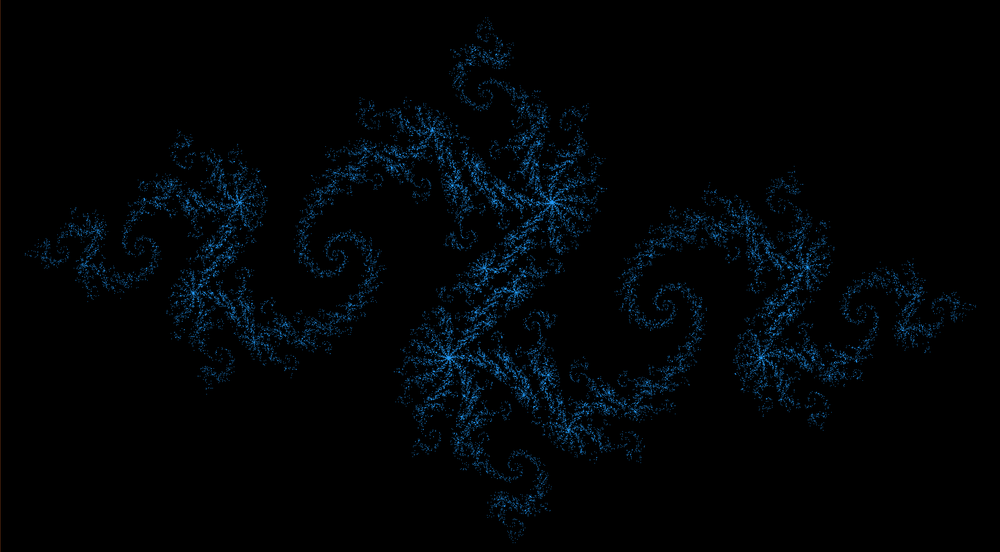
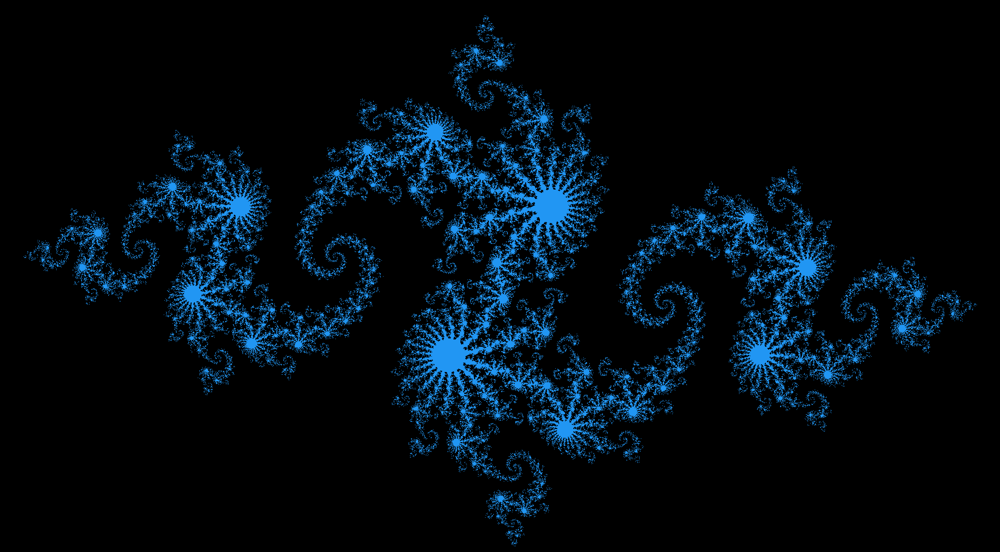
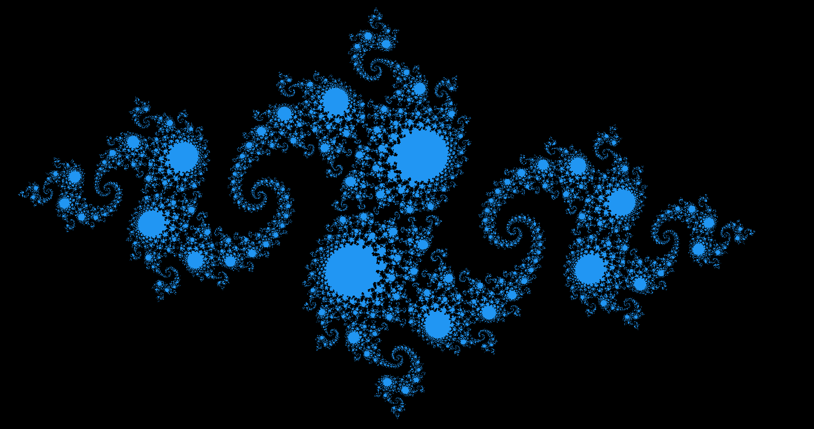

# Julia Set

CUDA program to visualize a Julia Set.

Below are images generated by this program.

## C = -0.8 + 0.166i

## C = -0.8 + 0.156i

## C = -0.8 + 0.153i

## C = -0.8 + 0.146i

## C = -0.8 + 0.136i

